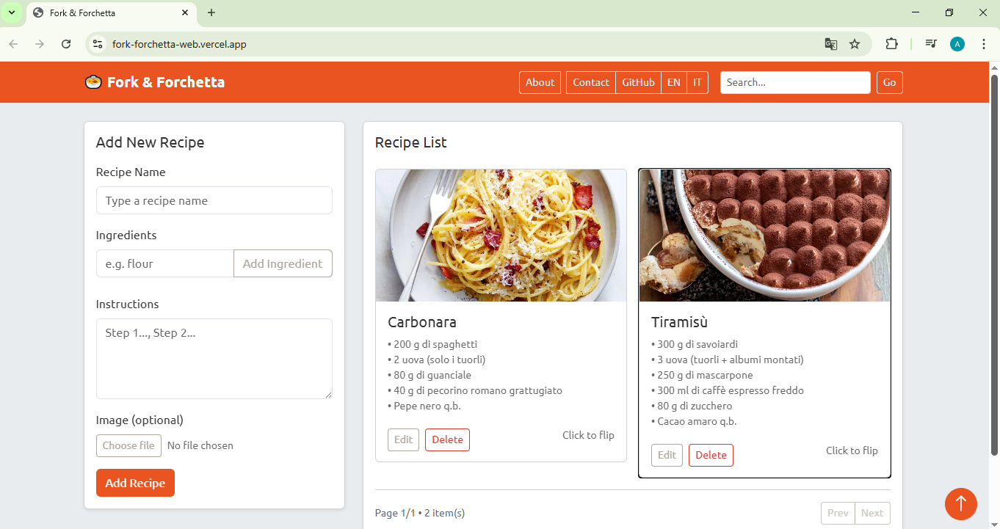
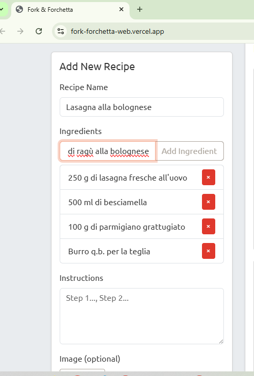
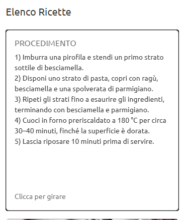

#  🇬🇧 Fork & Forchetta – Frontend

This is the frontend of the Fork & Forchetta recipe manager.
A lightweight and responsive web app built with HTML, CSS (Bootstrap/Bootswatch), and Vanilla JavaScript.
It communicates with the backend API (Node.js + Express + MongoDB + Cloudinary) hosted on Render.

---

## 🚀 Live
- Frontend (Vercel): https://fork-forchetta.vercel.app
- API (Render): https://fork-forchetta-api.onrender.com

---

## ✨ Features
- Add, edit, and delete recipes  
- Upload images via Cloudinary  
- Search & filter recipes  
- Pagination support  
- Language switch: English / Italian  
- Responsive design with Bootswatch United theme  
- **Integration tested via e2e tests**

---

## 🛠️ Tech Stack
- HTML5, CSS3
- Bootstrap 5 + Bootswatch United
- Vanilla JavaScript (Fetch API)
- Deployed on Vercel

---

## 📸 Screenshots

  
  
  

---

## Demo GIF


---

## ⚡ How to Run Locally
```bash
git clone https://github.com/aliyecodes/fork-forchetta-web.git
cd fork-forchetta-web
# Open index.html in the browser
# OR use a local dev server (recommended):
npx serve

    Make sure the backend API is running locally at http://localhost:5000.

---

# 🇮🇹 Fork & Forchetta – Frontend

Questa è la parte frontend del progetto Fork & Forchetta.
Un’applicazione web leggera e responsive realizzata con HTML, CSS (Bootstrap/Bootswatch) e JavaScript Vanilla.
Il frontend comunica con l’API backend (Node.js + Express + MongoDB + Cloudinary) ospitata su Render.

## 🚀 Live
- Frontend (Vercel): https://fork-forchetta.vercel.app
- API (Render): https://fork-forchetta-api.onrender.com

## ✨ Funzionalità
- Aggiungere, modificare e cancellare ricette
- Caricare immagini tramite Cloudinary
- Ricerca e filtro delle ricette
- Supporto per la paginazione
- Cambio lingua: Inglese / Italiano
- Design responsive con tema United di Bootswatch
- Test di integrazione tramite e2e

## 🛠️ Stack Tecnologico
- HTML5, CSS3
- Bootstrap 5 + Bootswatch United
- JavaScript Vanilla (Fetch API)
- Deploy su Vercel

## 📸 Screenshots

  
  
  

## Demo GIF


## ⚡ Avvio Locale
```bash
git clone https://github.com/aliyecodes/fork-forchetta-web.git
cd fork-forchetta-web
    # Puoi aprire index.html direttamente nel browser
    # O usare un server locale (consigliato):
npx serve
